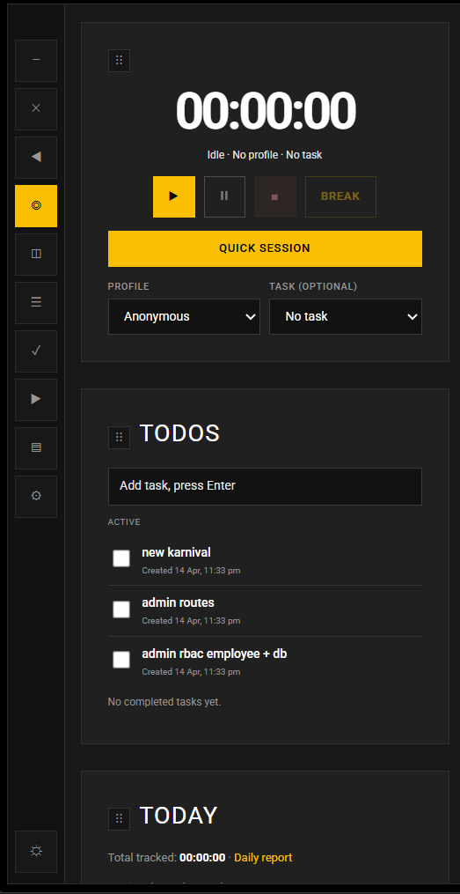
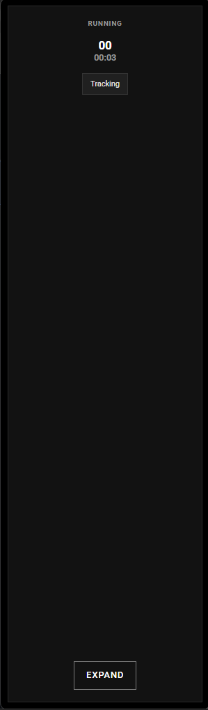
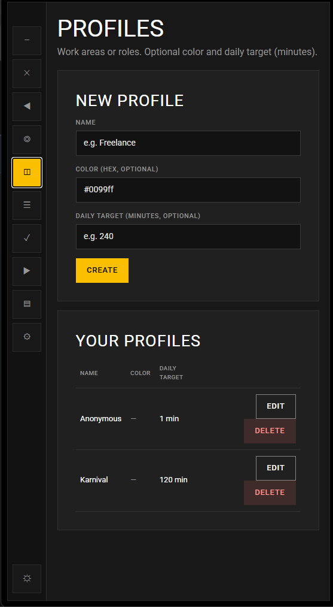
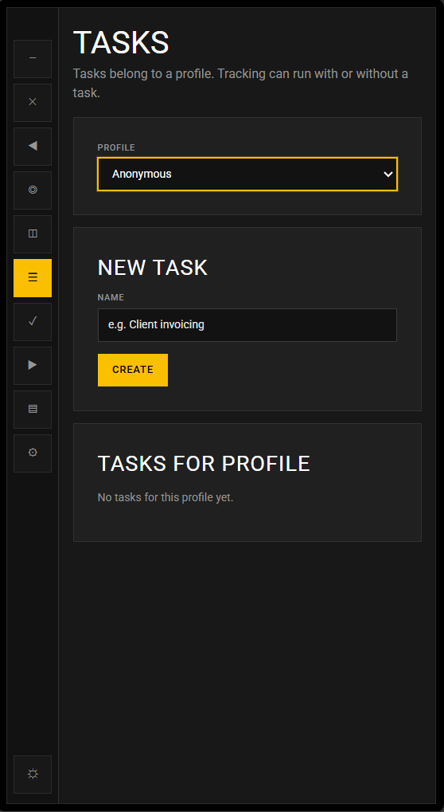
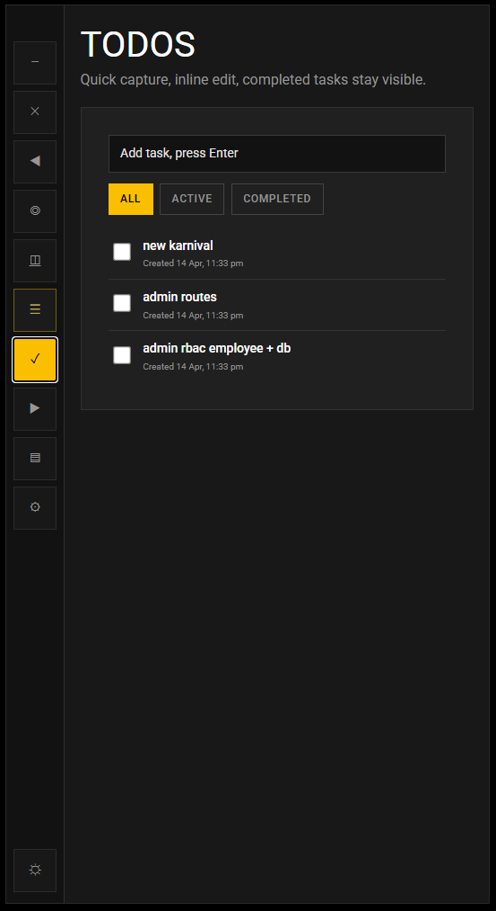
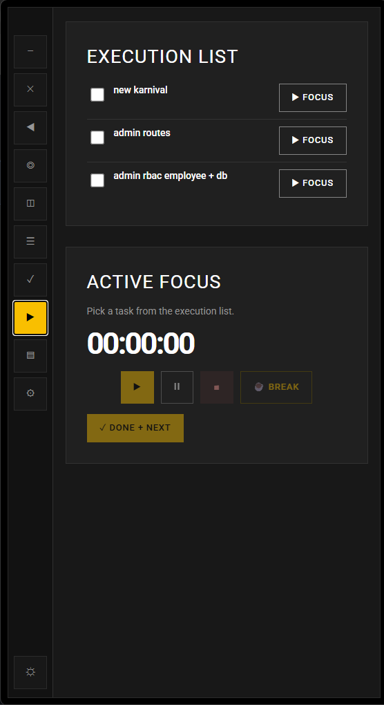
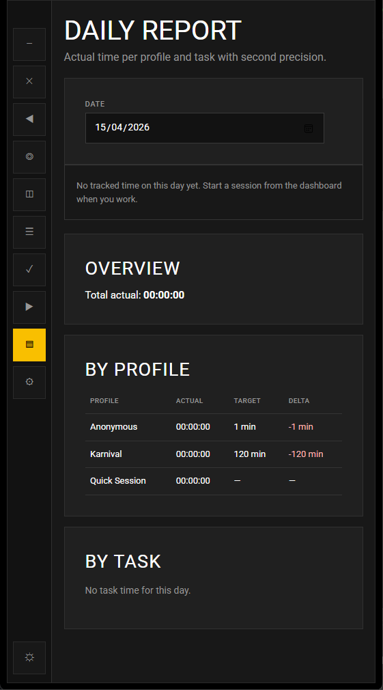

# Time Accountability Companion

A compact desktop productivity companion built with **Tauri + Rust + React + TypeScript**.  
It helps you track focused work time, manage profiles/tasks/todos, run execution flow, and review daily progress.

## Overview

The app is designed as a narrow companion panel that stays out of your way while still giving quick access to:

- session timer with profile/task context
- today snapshot and history
- todo workflow and execution mode
- daily report and maintenance tools

## Screenshots

### Main Overview
The main dashboard combines timer controls, current state, history, and quick workflow widgets.

### Collapsed Companion
The app can collapse into a compact rail view for minimal screen usage while keeping status visible.

### Profiles
Create and manage work profiles (areas/roles) used by sessions and reports.

### Tasks
Create tasks per profile and track focused work with optional task-level context.

### Todos
Todo section supports add/edit/done/remove behavior with metadata and lightweight organization.

### Execution Mode
Execution view supports focused task flow with timer controls and next-task progression.

### Daily Report
See daily totals and profile/task summaries for quick review of tracked time.

## Key Features

- **Session tracking:** start, pause, resume, stop, break, and notes support
- **Profile/task model:** structured time tracking across work contexts
- **History + reporting:** day-wise summaries and session visibility
- **Todo + execution flow:** compact todo management and focused execution page
- **Companion behavior:** docked narrow UI with collapsed mode for low distraction

## Background + Storage

- **Runs in background:** closing the window hides the app to tray/background instead of hard exit
- **SQLite persistence:** local database stores sessions, todos, and preferences
- **Clear/reset controls:** maintenance tools let you clear cached/preferences data and reset stored data when needed

## Tech Stack

- **Desktop shell:** Tauri (Rust backend)
- **Frontend:** React + TypeScript + Vite
- **Storage:** SQLite (local-first)
